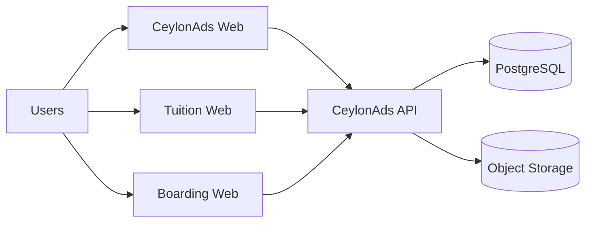
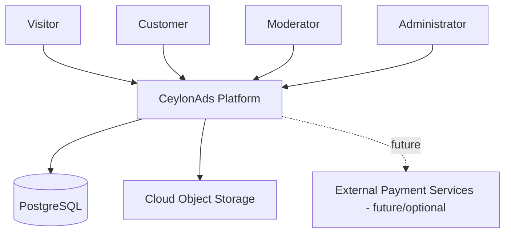
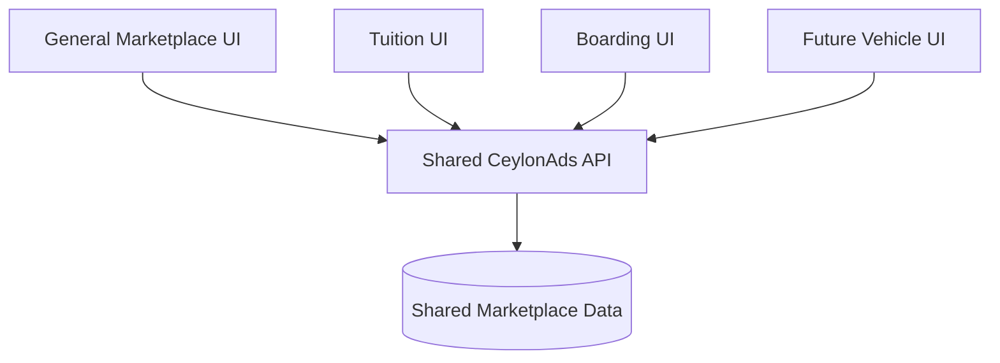
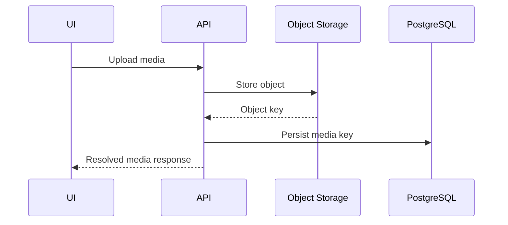

# CeylonAds — Architecture Document

**Document status:** Living document  
**Last updated:** 2026-08-26

## 1. Architecture Overview

CeylonAds is a modular web marketplace consisting of a Spring Boot backend, React/Vite frontend experiences, PostgreSQL persistence, object storage for media, and cloud deployment.

The architectural direction favors a shared marketplace backend with multiple frontend experiences.



## 2. Technology Stack

### Backend
- Java 26.
- Spring Boot 4.x.
- Gradle.
- Spring Security.
- JWT authentication.
- Spring Data JPA.
- Flyway.
- OpenAPI/Swagger.

### Frontend
- React.
- Vite.
- TypeScript.
- React Router.
- Axios.

### Persistence
- PostgreSQL for persistent deployed environments.
- H2 may be used where appropriate for isolated tests, but PostgreSQL behavior should be treated as authoritative for production compatibility.

### Media
- Google Cloud Storage has been used for deployed media.
- The media abstraction should allow storage details to remain environment-specific.

### Deployment
- Google Cloud Run has been used for CeylonAds deployments.
- Static frontend content has also been served through the Spring Boot application in earlier deployment stages.
- Future deployment may separate frontend hosting from the backend.

## 3. System Context



## 4. Backend Domain Structure

The backend follows package-by-domain rather than a large technical-layer-only organization.

Representative domains:

```text
auth
customer
admin
ad
category
location
media
search
promotion
payment
common
```

Each domain should own as much of its business logic as practical.

Cross-domain dependencies should remain deliberate and limited.

## 5. Main Architectural Components

### 5.1 Authentication

Responsibilities:
- Login/authentication.
- Password verification.
- JWT creation.
- JWT validation.
- Security context population.
- Role enforcement.

Roles currently include:
- CUSTOMER.
- MODERATOR.
- ADMIN.

### 5.2 Advertisement Domain

Responsibilities:
- Advertisement persistence.
- Advertisement lifecycle.
- Advertisement detail.
- Ownership.
- Category and location association.
- Media association.
- Public/private visibility rules.

### 5.3 Category Domain

Responsibilities:
- Hierarchical category structure.
- Category slugs.
- Category-specific attributes.
- Category navigation support.

The architecture must not flatten all category levels into one user-facing dropdown.

### 5.4 Location Domain

Responsibilities:
- Province/district/city hierarchy.
- Location lookup/filtering.
- Optional location association.

### 5.5 Search Domain

Responsibilities:
- Full marketplace search.
- Category-aware search.
- Location filtering.
- Expansion toward domain-specific filtering.

Search should use intentional predicates rather than unconstrained substring matching across unrelated fields.

### 5.6 Media Domain

Responsibilities:
- Upload validation.
- Storage.
- Media key persistence.
- Runtime/public URL resolution.
- Provider-specific storage implementation.

Architectural rule:

```text
DB stores media key
       ↓
Media URL resolver
       ↓
Environment-specific public URL
```

This avoids persisting cloud-specific URL formats as domain data.

### 5.7 Promotion Domain

Responsibilities:
- Promotion slots.
- Promotion plans.
- Promotion requests.
- Active promotion retrieval.
- Placement capacity.
- Approval lifecycle.

Promotions should be queried efficiently with required advertisement relationships eagerly fetched or projected to prevent N+1 behavior.

### 5.8 Payment Domain

Responsibilities:
- Payment method representation.
- Payment evidence.
- Relationship to promotional purchase/request.
- Administrative review where required.

The domain must support offline/manual methods without requiring an online gateway artifact.

## 6. Frontend Architecture

The frontend is a React SPA.

Representative routes include:

```text
/
 /ads
 /ads/:slug-or-id
 /login
 /account/...
 /admin/...
```

Vertical sites may have their own route structures while sharing the same backend.

Frontend architecture should distinguish:
- Public browsing state.
- Authenticated customer state.
- Privileged moderation/admin state.

Stable reference data such as categories and locations is a good candidate for client-side caching.

## 7. Multi-Site Architecture

A major architectural principle is:

> One marketplace backend, multiple specialized frontend experiences.



Benefits:
- No duplicate ad records.
- Shared accounts/authentication.
- Shared moderation.
- Shared promotion engine.
- Specialized UX per market.
- Cross-listing between general and vertical sites.

## 8. Public Route and SPA Handling

Deployed SPA routing must support direct navigation.

A direct request such as:

```text
/ads/example-ad-123
```

must ultimately return the SPA entry point when it is a frontend route, while API routes remain handled by backend controllers.

Important constraint:
- SPA fallback rules must never swallow `/api/**` routes.
- Spring Security must permit intended public frontend routes without unintentionally opening private APIs.

## 9. Persistence Architecture

Spring Data JPA is used for persistence.

Production-oriented rules:
- `ddl-auto` should not perform uncontrolled schema modification.
- Flyway owns schema evolution.
- Referential integrity is enforced in the database.
- Foreign-key columns used in common lookup paths should be indexed where appropriate.
- Slug and public lookup columns should have suitable indexes/constraints.

## 10. Flyway Strategy

Flyway migrations reside under:

```text
classpath:db/migration
```

Known migration direction includes:
- V1: baseline schema.
- V2: Sri Lanka location master data.
- V3: category and attribute master data.
- Subsequent migrations for controlled schema/reference-data changes.

V1 should describe the correct baseline schema and should not contain destructive cleanup statements that belong to legacy-production repair work.

Legacy production corrections should be handled explicitly and separately where needed.

## 11. Query Performance

Known concern:
- N+1 queries can occur when mapping advertisements and promotions with lazy relationships.

Architectural guidelines:
- Use fetch joins, entity graphs, projections, or dedicated read queries.
- Do not depend on Open Session in View to hide lazy-loading design problems.
- Review generated SQL for list/search/detail endpoints.
- Paginate potentially large collections.
- Cache stable frontend reference data.

## 12. Media Deployment Architecture

Current cloud-oriented flow:



Public reads resolve the appropriate accessible URL from the stored key.

## 13. Security Architecture

Security controls include:
- Password hashing.
- JWT authentication.
- Role-based authorization.
- Explicit public API rules.
- Admin/moderator separation.
- Customer ownership checks.

Example policy distinction:
- MODERATOR: approve/reject ads.
- ADMIN: approve/reject ads and approve promotions.

Public media access must be intentionally configured when media URLs are expected to be browser-accessible.

## 14. Environment Configuration

The project has used environment-specific Spring profiles such as:
- dev.
- test.
- prod.
- cloud/deployed profiles where required.

Environment-specific configuration should hold:
- Database URL/credentials.
- Storage provider/bucket.
- JWT secret.
- Public media base behavior.
- Logging/diagnostics.
- Migration settings.

Secrets must not be committed to source control.

## 15. Deployment Evolution

Current/previous CeylonAds hosting has included:
- Google Cloud Run.
- PostgreSQL providers including earlier Supabase usage.
- Google Cloud Storage for media.

The architecture remains portable enough to support future migration to another managed PostgreSQL/service environment if desired.

## 16. Architecture Decisions

### ADR-001 — Shared backend for vertical sites
**Decision:** Use a shared CeylonAds API/data model for general and specialized marketplaces.

**Reason:** Avoid duplicated listings, accounts, moderation, and promotions.

### ADR-002 — Store media keys, not full URLs
**Decision:** Persist storage keys and resolve URLs in code.

**Reason:** Prevent environment/provider URL details from leaking into persistent domain data.

### ADR-003 — Flyway owns schema
**Decision:** Use Flyway for controlled schema evolution.

**Reason:** Make dev/test/prod schema changes repeatable and reviewable.

### ADR-004 — Hierarchical categories
**Decision:** Model category hierarchy rather than presenting all levels as peers.

**Reason:** Improves search, navigation, and domain-specific filtering.

### ADR-005 — Offline-capable promotion payments
**Decision:** Promotion payment workflow must support manual/cash-like methods.

**Reason:** The Sri Lankan marketplace cannot assume every transaction is card/gateway based.

## 17. Known Architectural Risks

- Search relevance may degrade if generic matching is overly broad.
- Large category/location datasets require good frontend UX and caching.
- Promotion queries can produce N+1 problems without deliberate fetch design.
- A shared backend can become overly coupled if vertical-specific logic is not isolated.
- Serving frontend and backend from one Spring Boot service is simple but may become limiting at scale.
- Public object-storage access must be configured carefully.
- Manual production database scripts can drift from Flyway if not disciplined.

## 18. Near-Term Architecture Improvements

- Strengthen search/query design.
- Continue N+1/query review.
- Formalize vertical-specific API/read models only where necessary.
- Add clear caching strategy for categories, locations, and promotion metadata.
- Keep architecture diagrams synchronized with deployed topology.
