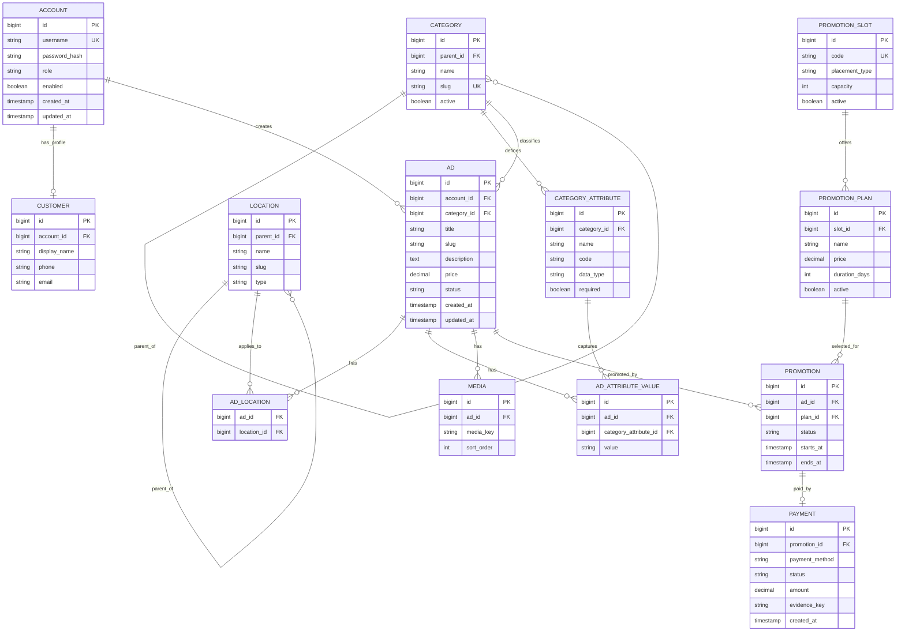

# CeylonAds — Database Documentation

**Database:** PostgreSQL  
**Migration tool:** Flyway  
**Document status:** Living document  
**Last updated:** 2026-08-26

> This document describes the known CeylonAds logical data model. Exact columns and constraint names should be synchronized from the latest Flyway migrations whenever the schema changes.

## 1. Database Principles

- PostgreSQL is the production database.
- Flyway owns schema evolution.
- Hibernate/JPA maps the application model but must not be treated as the production migration mechanism.
- Master/reference data is separated conceptually from sample transactional data.
- Foreign keys enforce relationships.
- Frequently queried foreign keys and slugs should be indexed.
- Media records store object keys rather than full provider-specific URLs.


## 2. Entity Relationship Diagram

The following ER diagram provides the high-level relational view of the current CeylonAds data model.



### Relationship Summary

```text
ACCOUNT
 ├── CUSTOMER
 └── AD
      ├── CATEGORY
      │    └── CATEGORY_ATTRIBUTE
      │          └── AD_ATTRIBUTE_VALUE
      ├── AD_LOCATION ─── LOCATION
      ├── MEDIA
      └── PROMOTION
            └── PROMOTION_PLAN
                  └── PROMOTION_SLOT
            └── PAYMENT
```

> The diagram is intentionally logical rather than a guaranteed byte-for-byte representation of every current column. Table names, join tables, and columns should be synchronized against the latest Flyway migrations when the implementation changes.


## 3. Core Tables

The original baseline was derived from the JPA model and included approximately fourteen main tables. The functional groups below are more important than preserving that exact count in documentation.

### 3.1 Accounts

Purpose:
- Authentication identity.
- Role assignment.
- Account state.

Typical concepts:
- Primary key.
- Username/login identifier.
- Password hash.
- Role.
- Enabled/status fields.
- Audit timestamps.

Important constraints:
- Username must be unique.

Roles currently include:
- CUSTOMER.
- MODERATOR.
- ADMIN.

### 3.2 Customer/Profile Data

Purpose:
- Store customer-facing account information that should not be mixed with authentication credentials.

Possible data includes:
- Display name.
- Contact details.
- Relationship to account.

The exact current split between `accounts` and customer/profile tables should be verified from current migrations.

## 4. Categories

### 4.1 `categories`

Purpose:
- Hierarchical marketplace taxonomy.

Key concepts:
- `id`.
- `name`.
- `slug`.
- `parent_id`.
- display/order metadata where present.
- active/enabled status where present.

Relationships:
- A category may have a parent category.
- A category may have many child categories.
- Ads are associated with a category.

Important indexes:
- `slug`.
- `parent_id`.
- Any fields used by active/category tree queries.

### 4.2 Category Attributes

Purpose:
- Define category-specific structured fields.

Examples:
- Vehicle make/model/year.
- Property type.
- Tuition mode.
- Other vertical-specific fields.

Known master-data migration direction:
- Category and attribute master data introduced through Flyway V3.

## 5. Locations

### 5.1 `locations`

Purpose:
- Store Sri Lankan geographic hierarchy.

Known hierarchy:
- Province.
- District.
- City.

Known master-data volume:
- 9 provinces.
- 26 districts.
- 258 cities.
- 293 total location rows in the structured master dataset.

Key concepts:
- `id`.
- `name`.
- `slug` where applicable.
- location type.
- `parent_id`.

Important indexes:
- `parent_id`.
- slug/name lookup columns used by APIs.

An ad may have no location where the service is online/non-geographic.

## 6. Advertisements

### 6.1 `ads`

Purpose:
- Core listing record.

Representative fields/concepts:
- `id`.
- title.
- slug or slug-compatible public identifier.
- description.
- price.
- status.
- owner/account reference.
- category reference.
- location relationship where applicable.
- timestamps.

Important rules:
- Public lookup should only expose eligible statuses.
- Price may be optional or zero for domains where price is negotiable/free/defined later.
- Legacy columns no longer part of the correct baseline must not be reintroduced.

Known baseline cleanup decisions:
- Legacy `ads.location_id` was excluded where the current model uses a different location relationship.
- Schema documentation must follow the actual latest migration, not old production residue.

### 6.2 Ad Location Relationship

The current logical model supports domain cases requiring optional or potentially multiple locations.

If implemented through an association table, document it as the authoritative relationship rather than relying on a legacy single `ads.location_id`.

## 7. Media

### 7.1 `media`

Purpose:
- Associate stored images/media with an advertisement.

Representative fields:
- `id`.
- ad reference.
- media/object key.
- ordering/type metadata if present.

Important rule:
- Store media key/object identifier, not the full GCS/public URL.

Known baseline cleanup:
- Legacy `media.url` should not be part of the clean V1 baseline where the media-key model is authoritative.

Important indexes:
- ad foreign key.
- ordering fields when frequently queried.

## 8. Promotion

### 8.1 `promotion_slots`

Purpose:
- Define where promotional inventory is displayed.

Representative concepts:
- code/name.
- placement type.
- capacity.
- active state.

Known placement example:
- `AD_DETAIL_SIDEBAR`.

Other placements may include:
- Homepage featured.
- Category featured.
- Vertical-specific featured areas.

### 8.2 `promotion_plans`

Purpose:
- Commercial offering attached to a promotion slot.

Representative concepts:
- plan name.
- slot reference.
- duration.
- price.
- active state.

### 8.3 `promotions`

Purpose:
- A customer's request/assignment of an advertisement to a promotional plan.

Representative concepts:
- ad reference.
- plan reference.
- status.
- start time.
- end time.
- approval data.

Known query requirement:
- Retrieve active promotions by status/slot/end date ordered deterministically.
- Fetch associated ad data efficiently to prevent N+1 mapping.

Typical active condition:

```text
status = ACTIVE
AND ends_at > now()
```

## 9. Payments

### 9.1 `payments`

Purpose:
- Store payment information/evidence associated with a commercial operation such as promotion.

Representative concepts:
- payment method.
- payment status.
- amount.
- reference/evidence key.
- related promotion/payment owner.
- timestamps.

Important migration note:
- A stale PostgreSQL CHECK constraint previously rejected valid values such as `CASH`.
- The clean baseline must reflect the application's actual enum set rather than retaining outdated legacy checks.

Payment evidence is optional for methods that do not naturally produce a slip.

## 10. Flyway Migration History

Known migration sequence:

### V1 — Baseline schema
Contains the clean application schema derived from the JPA model.

Important expectations:
- No destructive legacy `DROP` cleanup statements in a clean baseline.
- No stale `media.url`.
- No obsolete single-location column where the modern relationship has replaced it.
- No outdated payment-method CHECK that conflicts with application values.

### V2 — Location master data
Introduces the structured Sri Lankan location dataset.

Known row counts:
- 9 provinces.
- 26 districts.
- 258 cities.

### V3 — Category and attribute master data
Introduces the corrected hierarchical category taxonomy and associated attribute definitions.

Known master data size from the project work:
- Approximately 89 category records in the prepared hierarchy.

### Later migrations
Any post-V3 schema change must receive a new migration rather than editing a migration already applied to deployed environments.

## 11. Indexing Guidelines

Indexes should correspond to real query patterns.

Important candidates include:
- `accounts.username`.
- `categories.slug`.
- `categories.parent_id`.
- location parent/slug fields.
- public ad slug/public ID.
- ad owner foreign key.
- ad category foreign key.
- association-table foreign keys.
- media ad foreign key.
- promotion status.
- promotion plan/slot foreign keys.
- promotion end/start timestamps used by active-placement queries.

Avoid adding indexes without a query/access reason.

## 12. Data Integrity Rules

- Account usernames are unique.
- Foreign-key references must point to existing master/entity records.
- Promotion must reference a valid ad and plan.
- Plan must reference a valid slot.
- Media must reference its owning entity/ad.
- Hierarchical category/location parent references must not create invalid trees.
- Database enum/check constraints must match application enums exactly when checks are used.

## 13. Master Data vs Sample Data

### Master/reference data
Examples:
- Categories.
- Category attributes.
- Locations.
- Promotion slot definitions.
- Promotion plans where they are treated as deployment-wide product configuration.

Master data may belong in Flyway when it must exist consistently in every environment.

### Sample/dev data
Examples:
- Demo customer accounts.
- Demo ads.
- Demo promotions.
- Demo media.

Sample data should not be required in production.

## 14. Query Design Notes

Known performance issue:
- Mapping ads and promotion results can produce N+1 selects.

Preferred approaches:
- Dedicated fetch-join queries.
- Entity graphs.
- DTO projections.
- Batched reads where appropriate.

Do not rely on lazy loading through Open Session in View as the primary solution.

## 15. Production Migration Discipline

For every schema change:

1. Update entity/model code.
2. Add a new Flyway migration.
3. Validate migration against PostgreSQL.
4. Run automated tests.
5. Verify clean-database migration from V1 to latest.
6. Verify upgrade from a representative existing database.
7. Document the change here.

If production migrations are executed manually, the exact executed SQL and Flyway history must remain synchronized to avoid drift.

## 16. Schema Documentation Maintenance

Whenever a migration changes:
- Tables.
- Columns.
- Relationships.
- Constraints.
- Indexes.
- Enum/check values.
- Master data.

this document must be updated in the same implementation phase.
